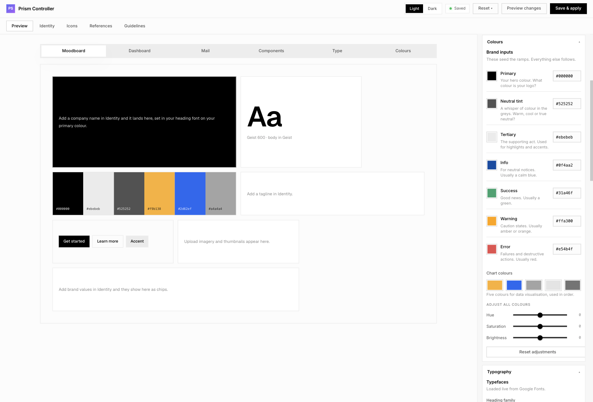

# Prism System



A white-label design system in a box. Clone it, feed it a brand, and generate on-brand product UI for web, mobile and native, with AI agents that stay on brand because everything they touch is themed from the same tokens.

Nothing here is tied to any one company. Fork it, brand it, generate.

## What this is

Prism System is a monorepo that carries everything a product team needs to look like itself: one token source of truth, a themed component library, build pipelines for web and iOS, a visual controller that turns a brand into a working theme in minutes, and an agent layer that generates product screens from that theme.

The mental model is a bubble you step inside. You run the controller, feed it your brand (colours, fonts, a logo, reference imagery, even a Figma file or an existing website), and it derives a complete token system and rebuilds every output so the whole repo now speaks your brand. From then on, any UI generated inside the repo is on brand by construction, because it is built from those tokens and nothing else.

## In numbers

| Layer | What it is | Count |
| --- | --- | --- |
| Skills | Task recipes the agents follow, in `packages/tokens/.agents/skills/` | 108 across 8 categories |
| Agents | Personas that own the work | 9 |
| Routes | The entry classifier that picks a skill sequence | 5 |
| MCP tools | The engine: token lookup, contrast, scoring, gating, audit | 24 |
| Packages | Tokens, three built themes, two component sets, icons | 8 |
| Platform outputs | CSS variables, SCSS, Swift | 3 |

## Structure mapping

A request flows top to bottom. The router is a small keyword classifier that picks one of five routes; each route names a fixed skill sequence; skills are run by agents; the whole thing sits on the MCP engine and ends in a generated artefact.

```
Entry            /design-start  ·  /engineer-start        (one command per editor)
   |
Router           prototype · ui-craft · new-experience · handoff · corpus-distill
   |             (keyword classifier -> a fixed skill sequence per route)
   |
Skills (108)     8 categories
   |             foundations 8 · design 19 · handoff 6 · react 20
   |             figma 21 · discovery 9 · quality 14 · workflow 11
   |
Agents (9)       Architect · Code · Content · Design Engineer · Designer
   |             Figma Executor · PM · React Expert · Testing
   |
Engine           MCP server, 24 tools (token-lookup, contrast, design-score,
   |             foundation-gate, audit, ramp-lookup, ...)
   |
Artefact         a themed screen or component under sandbox/<run>/
```

The registry lives in `packages/tokens/.agents/skills/skills.json` as a lean six-field index (name, description, category, path, agents, autonomy). Optional metadata (intents, the compose graph, inputs and outputs, gates) sits alongside it in `skills.extended.json`, so the file you scan day to day stays readable. Agents are defined in `.github/agents/`; the router is `packages/tokens/.agents/skills/design/design-router.md` with a fast heuristic in `packages/tokens/mcp-server/tools/design-route.js`.

## Reusability

The system is built to be forked and rebranded, not to serve one brand. Everything brand-specific is data, and everything generic is code. A new brand touches the token sources and the brand corpus, never the components, the skills or the pipelines. The same repo can carry a completely different brand by feeding the controller a different set of inputs and pressing Save.

Because the outputs are plain tokens (CSS variables, SCSS, Swift) and a standard component set, you can also lift the built theme into an app that lives outside this repo. Use the tokens or the `@ds/ui` components directly, or generate screens here and copy them out. Nothing locks you in.

## Theming

One source, every platform. The controller writes your brand into `packages/tokens/src/tokens.json` and `packages/tokens/data/resolved-hexes.json`. A reconcile step in `packages/output` merges the two, then Style Dictionary builds the platform outputs: CSS variables into `packages/theme-css`, SCSS into `packages/theme-scss`, Swift into `packages/theme-ios`. The same build regenerates `packages/ui/src/styles/theme.css`, so the shadcn/ui components and everything built from them pick up the brand automatically.

The engine does real colour work, not just find-and-replace. From your seed colours it generates full perceptual ramps in OKLCH, checks WCAG contrast, and derives the semantic theme tokens (background, card, primary, muted, borders, the chart slots) for both light and dark. A material layer sits on top for surface style: flat, elevated, glass, soft or outline, with fine control over blur, opacity, tint and highlight, so you can dial in the iOS-glass look or keep it flat.

## The Prism Controller: kick off your design language

The controller is a zero-dependency Node server at `tools/controller`, served at `http://localhost:4400`. The left rail defines the brand; the right side previews it live against real surfaces.

The rail works top down. Theme presets give a one-click starting point (42 tweakcn themes) you then refine. Colours sets the primary, neutral tint, tertiary, semantic and chart hues, with a hue/saturation/brightness pass over the whole palette. Typography picks heading and body fonts, Shape controls radius, Spacing the density, Effects the shadows, and Material the surface style. A derived-tokens table shows every token the engine computes, so nothing that lands in the codebase is a mystery.

The preview has tabs so you can judge the theme honestly: a Moodboard, a full Dashboard, a Mail client, the Components sheet, Type specimens, and a Colours tab that lays out every generated ramp and the resolved theme tokens for the current mode.

Beyond colours and type, the controller captures your actual design language. Drop a reference screen or paste a Figma link and it reads the real specifics, spacing, radius, colour usage, component recipes and signature moves, straight from the Figma desktop MCP with no token or API key. You pick which values seed the system, and the generation agents read the captured language before composing any screen, so output looks designed rather than default. Identity records the name, tagline, voice and values; Guidelines collects the written rules. Every save takes a timestamped backup, so experiments are cheap.

## Step by step

### 1. Start with the controller

```sh
git clone <your-repo-url> prism-system
cd prism-system
npm install --legacy-peer-deps
npm run controller       # http://localhost:4400
```

Set your brand. Pick a preset or set your colours, choose fonts, dial in shape, spacing and material. If you have a Figma file or a reference screen, capture its design language in the References tab and apply the values you want. Press **Save & apply**. The controller rewrites the token sources and rebuilds every output, so the whole repo now carries your brand.

### 2. Move into VS Code, or the LLM of your choice

Open the repo in your editor. The agent layer is shared across Claude, Cursor, Copilot, Codex and Continue, all reading the same skills. Kick off work with a command:

```
/design-start      guided design intake: explore, create, check or hand off
/engineer-start    turn a design or prototype into production code
```

The router classifies your request and loads only the skills that route needs, so context stays small and focused.

### 3. Prompt UI, web, mobile or native

Describe what you want to build. Because everything is themed from the same tokens, the output is on brand automatically:

- **Web UI** comes out as `@ds/ui` (the themed shadcn set) with icons from `@ds/icons`, bound entirely to tokens.
- **Mobile web** uses the same components and the responsive token scale.
- **Native iOS** pulls the Swift tokens from `packages/theme-ios`, so a SwiftUI screen matches the web to the pixel value.

Every run lands in a dated folder under `sandbox/`, with a manifest of what was asked and what came out. Nothing overwrites anything, so you can generate freely and keep what works.

## What lands where

The tokens in `packages/tokens/src` are the single source of truth: when anything disagrees with them, they win. The brand, once saved, lives in the token sources and in `design-corpus/brand/GUIDELINES.md` and `DESIGN-LANGUAGE.md`. Generated work lands in `sandbox/`, one folder per run. `START-HERE.md` is the one-page orientation; `design-start.md` and `engineer-start.md` carry the two intake flows.

## Requirements

Node 22 or later and npm. The Figma desktop app with its Dev Mode MCP server enabled is optional, and only needed if you want the controller to read design language straight from a Figma file. The local `claude` CLI is optional too; without it, image analysis falls back to client-side colour extraction.

## Open source, not for sale

Prism System is open source and free. Use it for your own projects, or for work you do for your clients. It is not a product to be sold or resold; the value is in what you build with it, not in the system itself. Take it, brand it, ship real things with it. See `LICENSE` for the legal text.
